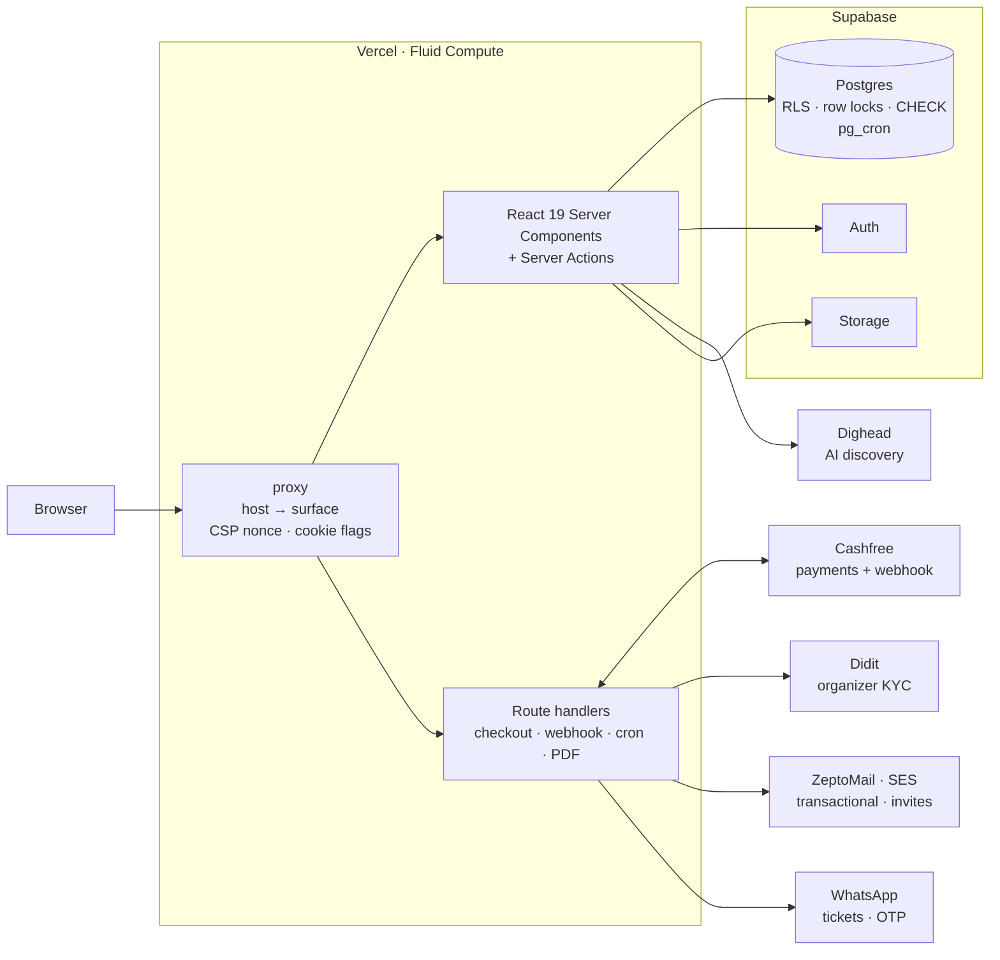
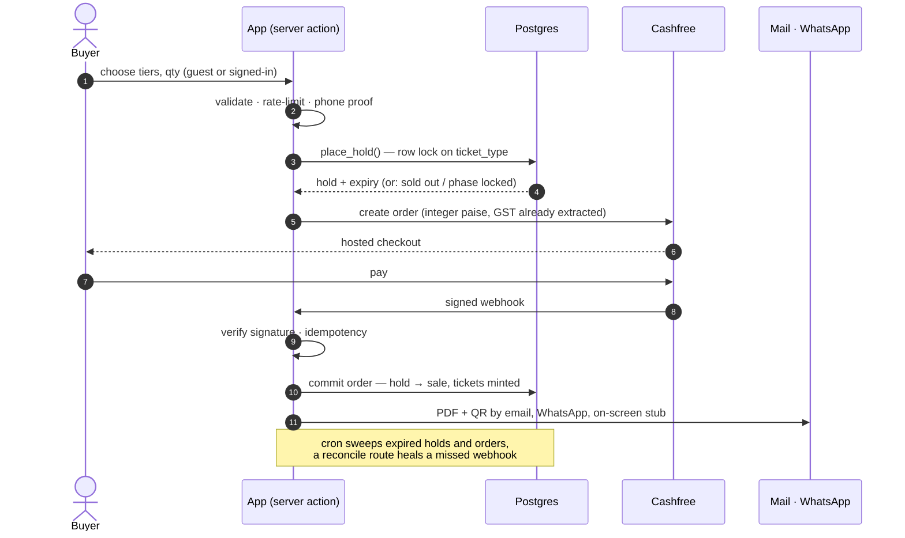

<div align="center">


```text
 ███████╗██╗  ██╗██╗███╗   ██╗██████╗ ██╗ ██████╗ ███████╗
 ██╔════╝██║  ██║██║████╗  ██║██╔══██╗██║██╔════╝ ██╔════╝
 ███████╗███████║██║██╔██╗ ██║██║  ██║██║██║  ███╗███████╗
 ╚════██║██╔══██║██║██║╚██╗██║██║  ██║██║██║   ██║╚════██║
 ███████║██║  ██║██║██║ ╚████║██████╔╝██║╚██████╔╝███████║
 ╚══════╝╚═╝  ╚═╝╚═╝╚═╝  ╚═══╝╚═════╝ ╚═╝ ╚═════╝ ╚══════╝
   discover  ·  reserve  ·  ticket  ·  scan   —  live acts of India
```

**Event ticketing, reservation and discovery for independent artists, comics and promoters.**
<br/>One database. Five surfaces. Zero oversold seats.

<br/>

[](https://nextjs.org)
[](https://react.dev)
[](https://www.typescriptlang.org)
[](https://tailwindcss.com)
[](https://supabase.com)
[](https://vercel.com)

[](#-money-is-integers-and-gst-is-extracted)
[](#-everything-else-that-ships)
[](#-the-one-rule-that-never-bends)
[](#-checks-not-tests)
[](#-the-one-rule-that-never-bends)
[](LICENSE)

<sub>[The rule](#-the-one-rule-that-never-bends) · [Surfaces](#-five-surfaces-one-deploy) · [Architecture](#-architecture) · [The sale](#-the-sale-hold--pay--fulfil) · [Money](#-money-is-integers-and-gst-is-extracted) · [Door](#-the-door)</sub>

</div>


> **View only.** This is a showcase. The source code is private and all rights are reserved. See [LICENSE](LICENSE).

```text
$ npm run check
— tests/bento.check.mts                  ok
— tests/didit-webhook.check.mts          ok   ← webhook signature verification
— tests/door-code.check.mts              ok
— tests/email-escaping.check.mts         ok   ← 24 templates, nothing typed reaches HTML raw
— tests/hosts.check.mts                  ok   ← five hosts, three sessions
— tests/pricing.check.mts                ok   ← GST extraction, commission taken once
  … 85 files, no framework, no fixtures, no runner
$ npm run build
✓ Compiled successfully   ✓ Type-checked   ✓ 88 pages   ✓ 40 route handlers
```

---

## ▍ What it is

Shindigs treats a live show as **three verbs, not one**, and each is a surface:

| Verb | What it means | Where |
|---|---|---|
| **Discovery** | Public site, SEO-first event pages, and *Dighead*, a mood-based AI search | public site |
| **Reservation** | The *hold* a seat takes while checkout runs: spoken for, not yet sold | Postgres |
| **Ticketing** | The sale, the ticket (screen + PDF) and the door that scans it | attendee · organizer · door |

Organizers publish; the public finds and buys. **Publishing makes an event public, and a sale decrements the organizer's inventory live.** The audience is deliberately narrow: independent artists, comics and promoters. Not venues-at-large, not enterprise.

---

## ▍ The one rule that never bends

> **No overselling. Ever.**

```text
  buyer A ─┐                                   ┌─ ticket_types row   (FOR UPDATE)
           ├─► place_hold() ─► BEGIN ─────────►│    sold + held + qty  ≤  capacity
  buyer B ─┘                    │              └─ CHECK (…)          ← backstop
                                │
        second buyer WAITS on the row lock,     if the app is wrong, the
        re-reads the true count, then commits   database is not.
        or is refused.
```

Inventory commits inside one Postgres transaction with `SELECT … FOR UPDATE` on the ticket-type row, **plus a `CHECK` constraint as a backstop**. Ticket *phases* (locked tiers, "opens after the first tier sells out", sales windows on a clock or as an offset from doors) are enforced in the same function, so no client can skip a rung.

---

## ▍ Five surfaces, one deploy

One Next.js deploy, one Supabase project, one user per person, **three separately scoped sessions**. The host of the request decides which surface you are on.

```text
                          ┌───────────────────────────────────────────────┐
                          │             ONE Next.js 16 deploy             │
                          │        edge proxy  ─►  host → surface         │
                          └──┬─────────┬──────────┬─────────┬──────────┬──┘
                             │         │          │         │          │
                       shindigs.cc   app.       events.    qr.       admin.
                             │         │          │         │          │
                        ┌────▼───┐ ┌───▼────┐ ┌───▼────┐ ┌──▼───┐ ┌────▼───┐
                        │ PUBLIC │ │ATTENDEE│ │ORGANIZ.│ │ DOOR │ │ ADMIN  │
                        │  site  │ │console │ │console │ │ staff│ │console │
                        └────┬───┘ └───┬────┘ └───┬────┘ └──┬───┘ └────┬───┘
                        guest or    attendee    organizer  signed     admin
                        attendee    session     session    door cookie session
```

| Surface | Canvas | Sign-in |
|---|---|---|
| **Public site** | dark violet | attendee session *or* guest checkout |
| **Attendee console** | blue/mint, toggleable | Google · WhatsApp OTP |
| **Organizer console** | blue/mint, toggleable | email + password |
| **Staff door** | blue/mint dark | organizer's email + a door code |
| **Admin** | blue/mint dark | email + password, and an allow-listed admin row |

The staff door carries **no account session at all**, only a signed door cookie, so a lost phone at a gate can never become a console login.

---

## ▍ Architecture



**Stance.** Server Components own the reads, Server Actions own the writes, and Postgres owns the invariants. Anything that must hold under concurrency (inventory, idempotent fulfilment, refund state) lives in SQL, behind row-level security and explicit function grants.

| Layer | Choice |
|---|---|
| Framework | Next.js 16 App Router, React 19 |
| Data | Supabase Postgres, 160+ additive migrations |
| Auth | Supabase Auth, three cookie-scoped sessions |
| Payments | Cashfree, integer paise everywhere |
| Mail | ZeptoMail (transactional), SES (invite campaigns) |
| Messaging | WhatsApp for ticket delivery and phone proof-of-ownership |
| KYC | Didit, gating payouts only |
| Tickets | `pdf-lib` + `qrcode`; screen stub and PDF are one design in two orientations |
| Door scan | `@zxing/browser`, lazy-loaded so it never ships to people who never open a door |
| Motion | GSAP, registered in exactly one place |
| UI | shadcn/ui on Base UI, three palettes, one token system |

---

## ▍ The sale: hold → pay → fulfil



A declined card **retires** the attempt without **terminating** the event for that buyer. An early version locked people out of a whole event after one bad card.

---

## ▍ Money is integers, and GST is extracted

Money is **integer minor units (paise)** end to end, and the rupee↔paise and signature code is kept import-free so it can be asserted in isolation.

```text
  sticker price  ₹ 1,180   ─┐
                             ├─ GST extracted (never added on top)      ₹ 180
  organizer net  ₹ 1,000   ─┘
        └─ commission taken ONCE, on the pre-GST base
  ─────────────────────────────────────────────────────────────────────────
  refunded order  →  stops earning commission,  KEEPS its platform fee
  sub-₹500 ticket →  zero GST, for every organizer
```

*Illustrative numbers.* The invariants are pinned by checks, and a conservation sweep asserts that what the buyer paid equals what is split between organizer, platform and tax.

---

## ▍ The door

```text
  ┌──────────────────────────┐        ┌──────────────────────────┐
  │  qr.shindigs.cc          │        │  attendee phone          │
  │                          │        │                          │
  │   [ organizer email ]    │        │   ┌──────────────────┐   │
  │   [ door code       ]    │  scan  │   │ ▄▄▄▄▄ ▄▄  ▄▄▄▄▄  │   │
  │   [ ▶ open camera   ]◄───┼────────┼───│ █   █ ▀▄▀ █   █  │   │
  │                          │        │   │ █▄▄▄█ ▄▀▄ █▄▄▄█  │   │
  │  ✔ checked in · 19:42    │        │   └──────────────────┘   │
  └──────────────────────────┘        │   tap to enlarge · wake  │
     signed cookie, no account        │   lock keeps it lit      │
                                      └──────────────────────────┘
```

- Staff sign in with the organizer's email and a door code. No console access.
- Check-in has a database-fault path so a **real attendee is never turned away by a hiccup**.
- The phone screen *is* the scanning surface: tap-to-enlarge QR plus a wake lock.
- The camera reader loads only when a door is opened.
- Offline-capable check-in for rooms with bad signal.

---

## ▍ Everything else that ships

<table>
<tr><td width="50%" valign="top">

**For the public**
- SEO-first event pages (JSON-LD, sitemap, social cards)
- **Dighead**: describe a mood, get picks
- Guest checkout with WhatsApp phone proof
- Ticket transfer, waitlist, follows, calendar links, reminders
- Recurring events collapsed to one card per series

**For organizers**
- 3-step create wizard; live-event edits walk the same wizard
- Ticket tiers, phases, sales windows, discount codes, cover charge
- Guest lists with CSV/XLSX import (xlsx parsed with zero dependencies)
- Contact book, block-based email composer, WhatsApp invites
- Teams, table bookings, per-event readiness checklist
- Payouts gated on Didit identity verification
- Dighead for organizers: a console assistant with tools

</td><td width="50%" valign="top">

**For operators**
- Approvals, refunds, payouts, earnings, people, admins
- Guest delivery ledger (email + WhatsApp, per ticket)
- System health, free-tier meters, server error log
- Admin unpublish / publish / delete with cascade

**For the platform**
- One atomic rate limiter across every public entry point
- Email outbox with retries; cron lease so sweeps never overlap
- In-database schedules via `pg_cron`
- Nightly DB backups
- Strict CSP with per-request nonce, hardened cookies and headers
- Column-level and function-level grants

</td></tr>
</table>

---

## ▍ Checks, not tests

85 plain `node:assert` scripts. No framework, no fixtures, no runner. They import the pure modules by relative path, so every module a check touches stays free of framework imports. The modules you least want unchecked are checked hardest: money, the webhook signature, GST extraction, host routing, and email escaping across all 24 templates.

## ▍ Conventions that are load-bearing

| Rule | Reason |
|---|---|
| **A server action never throws a message meant for a person; it returns `{ error }`** | Next strips thrown messages in production, so a useful refusal became a generic digest. |
| **Success is a toast, not an inline tick** | An inline tick under a sticky bar was never seen. |
| **A saved record opens locked** | Nobody is deliberately *in* a screen of live fields. |
| **Animated hero is served through a raw ``** | Next's optimizer re-encodes animated sources to a still frame. |
| **Time is UTC in the DB, rendered in `Asia/Kolkata`** | A UTC host would show a late-night IST event on the previous day. |
| **`grid-cols-1` on any grid wider than a phone** | The implicit grid track stretched a 390px screen to 1082px. |

## ▍ Design

Three palettes, one system: violet for the marketing surface, blue/mint for both consoles, and a light mode as the reader's opt-in. The theme is a cookie read on the server, so there is no flash and no client theme script.

---

## ▍ Contact

arcxx1995@gmail.com

<div align="center">

```text
   ┌──────────────────────────────────────────────┐
   │  made for the ones who play the small rooms  │
   └──────────────────────────────────────────────┘
        ▂▃▅▇█▇▅▃▂  doors at 7 · first act at 8  ▂▃▅▇█▇▅▃▂
```

</div>
